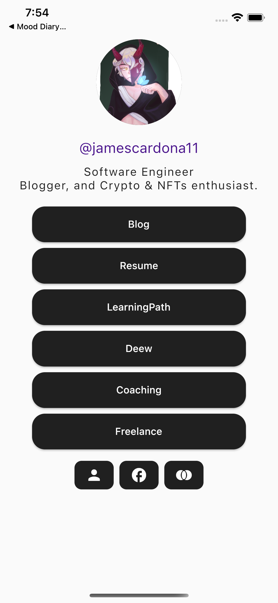

# Flutter course

## Contenido
1- Conocimientos previos Flutter y POO
2- Widgets aplicación contact card
3- Base de datos Mood diary app
4- Api request, ChuckNorris API
5- StateManagement TBA
  - Inherited Widget y variaciones
  - Provider y Riverpod
  - Bloc y Cubit
  - Rx
6- Arquitectura TBA
7- Ui Avanzado
8- Resolviendo pruebas técnicas
9- Firebase suit
10- Maps & Location
11- Dart y Web3

## App Contact Card

  

## App Mood diary

  

## App ChuckNorris

  

